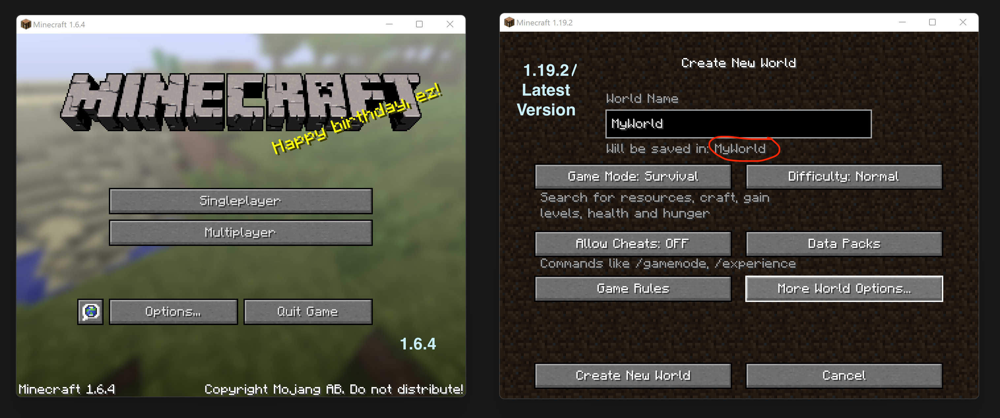
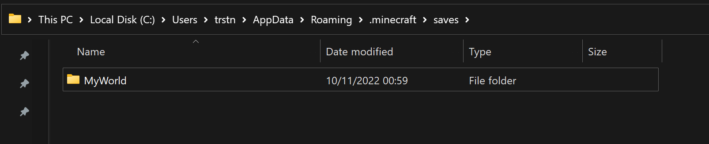
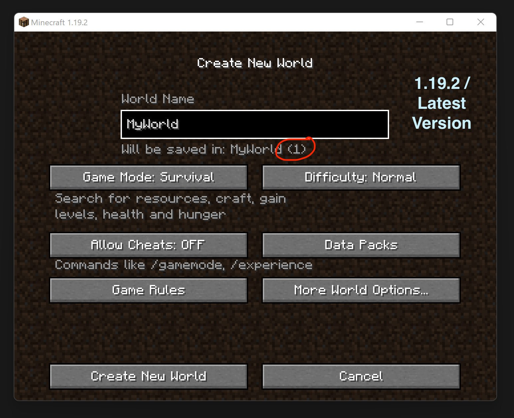
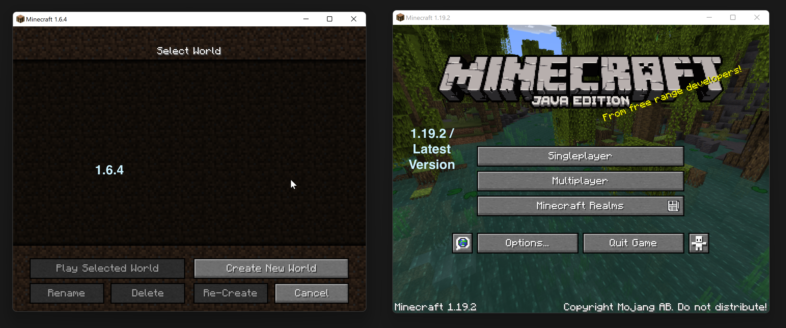
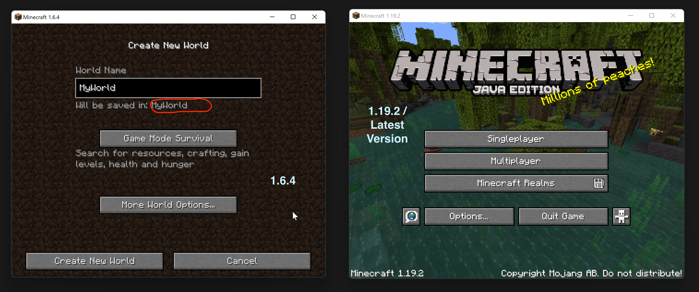
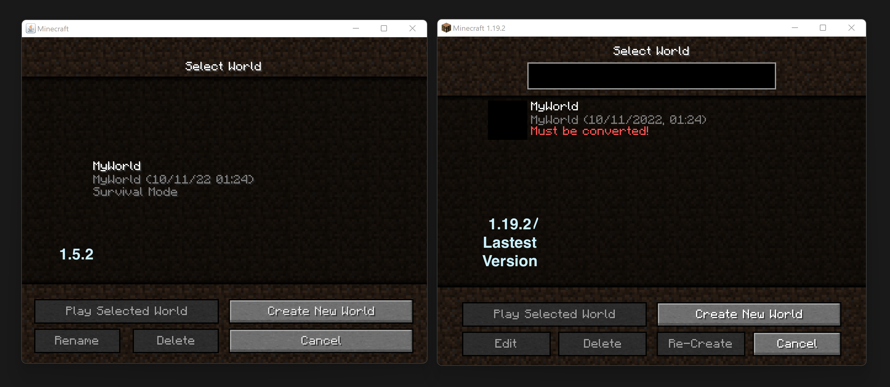
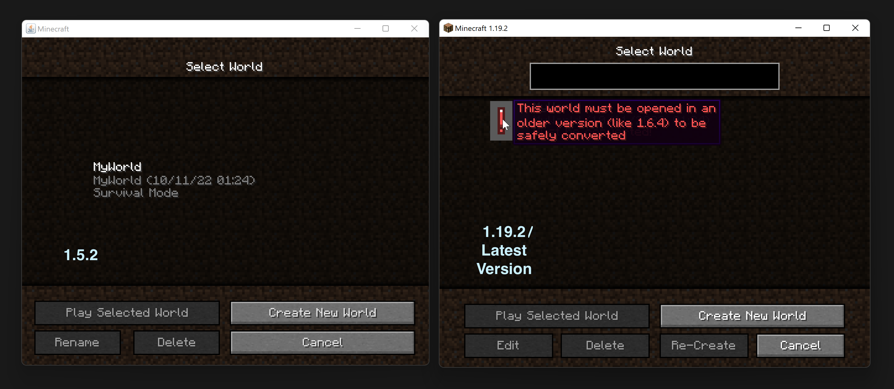

# Explained

It might be hard to understand what is happening, thats why we suggest to start with the section [Setting Up](SettingUp.md).

## Duplicate World Names

When creating a new world, you can see that the world will be saved in the file name: **MyWorld**.

The World is now saved in the following file name.

When creating a new world with the same name, you can see that the world will be saved in the file name: **MyWorld (1)**.
This is not what we want, you can see why we dont want that in a later paragraph.

## Bypassing Duplicate World Name Fix

In version (**1.6.4**) we see that the world created in the modern version does not show up. This is great, you can why in the next part.

We can use this advantage to create a world with the same name and generate **default** chunks in the modern world while playing in the same world file.

*Minecraft does not check in the file system, but checks if the minecraft world is valid, if not you can create a name with the same name and play in the same file. I call it **File Unifying***

After creating the new world, you can see that there is no extra world name, but the same folder with two (rendered) world chunks in one.

## Why 1.6.4?

Simple, when using versions below (**1.6.4**) you can see that in modern versions you get converting issues.

In hovering over it it tells you that it must be opened in (**1.6.4**). Thats why we use (**1.6.4**).

